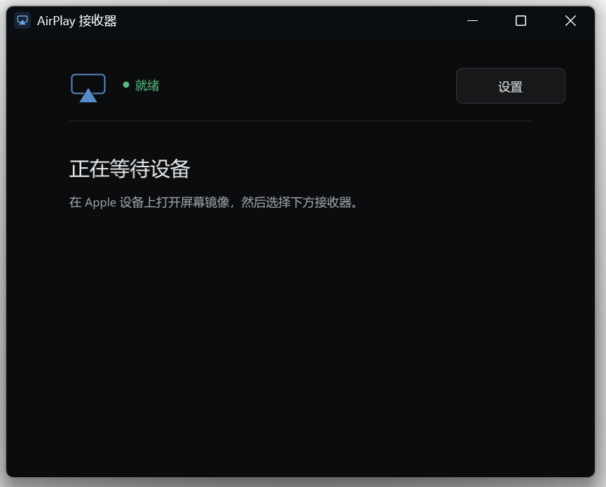
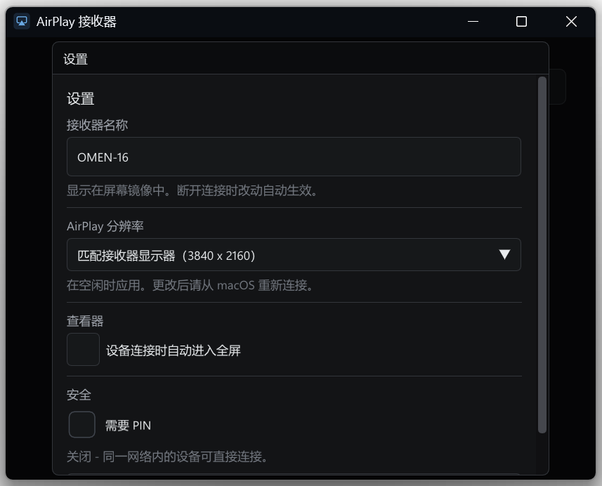
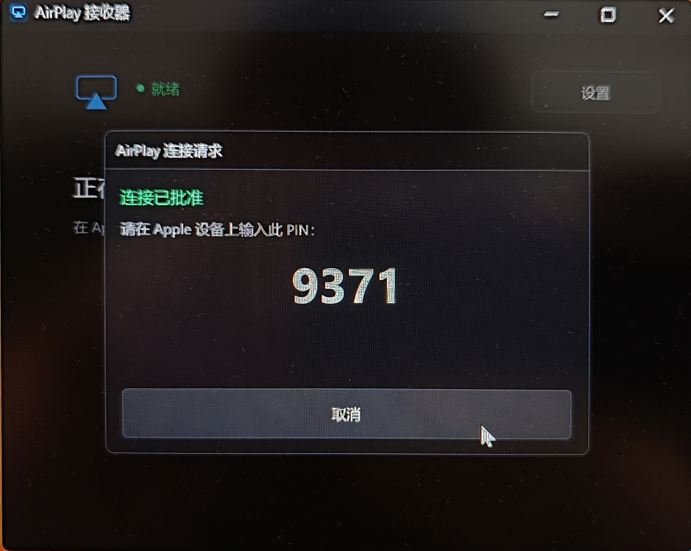
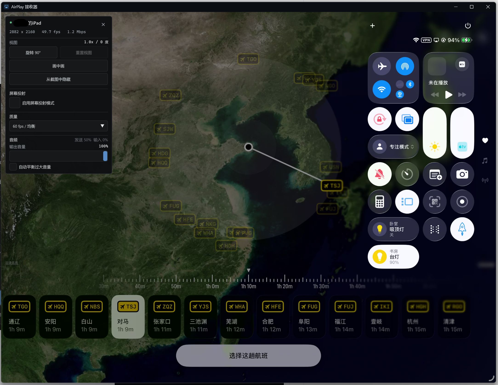
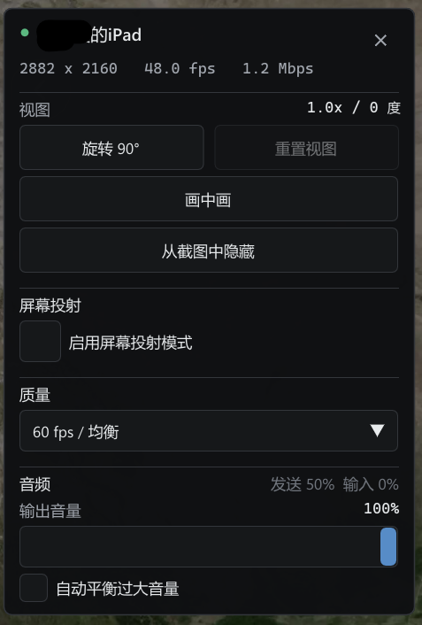

# AirPlayServer 中文版（汉化）

> 本仓库是 [xenos1337/AirPlayServer](https://github.com/xenos1337/AirPlayServer) 的**简体中文汉化版**，在 MIT 协议下 fork 并修改 UI 界面、窗口标题、提示文案、README 等所有用户可见文本，方便中文用户使用。所有原项目功能、协议实现、性能特性保持不变。
>
> 原作者保留全部代码版权。本汉化版仅做本地化工作，不修改 AirPlay 协议、解码、网络等核心逻辑。如需了解原始英文版，请访问 [上游仓库](https://github.com/xenos1337/AirPlayServer)。
>
> 上游声明：原项目本身是 [fingergit/airplay2-win](https://github.com/fingergit/airplay2-win) 的更新 fork。

AirPlayServer 在 Windows 上接收 AirPlay 视频、音频和屏幕镜像。

## 主界面
<div align="center">
    
</div>

<div align="center">
    <table>
        <tr>
            <th>设置</th>
            <th>PIN 审批</th>
        </tr>
        <tr>
            <td>
                
            </td>
            <td>
                
            </td>
        </tr>
    </table>
</div>

## 查看器
<div align="center">
    
</div>

##
<div align="center">
    <table>
        <tr>
            <th>控制栏</th>
            <th>画中画模式</th>
        </tr>
        <tr>
            <td>
                
            </td>
            <td>
                
            </td>
        </tr>
    </table>
</div>

## 安装

1. 从 [Releases](https://github.com/HZDavy/AirPlayServer-zh-CN/releases/latest) 下载中文版 `AirPlayServer-zh-CN-x64.zip`。
2. 解压压缩包。
3. 如尚未安装，请安装 [Bonjour for Windows](https://support.apple.com/kb/DL999)。iTunes 也内置 Bonjour。
4. 运行 `AirPlayServer.exe`。

启动时若未安装 Bonjour 或服务未运行，应用会弹出中文提示。

### 系统要求

- Windows 10 及以上，x64
- Apple Bonjour for Windows，用于通过 mDNS 进行设备发现

## 功能特性

- 接收 iOS 与 macOS 的 AirPlay 视频、音频和屏幕镜像
- 30 与 60 FPS 画质预设
- GPU 纹理上传与 YUV 转 RGB
- 帧节奏控制，播放更平滑
- 实时窗口缩放
- 接收端分辨率可匹配显示器或手动设置
- 自动 Bonjour 服务广播
- 全中文界面与提示

## 使用方法

1. 启动 AirPlayServer。
2. 在 iPhone 或 iPad 上打开控制中心，或在 Mac 上打开 AirPlay 菜单。
3. 从列表中选择这台 Windows PC。
4. 开始镜像或播放。

### 接收端分辨率

打开「设置」，用「AirPlay 分辨率」控制向 macOS 广播的显示尺寸。默认为「匹配接收端显示器」：接收端空闲时，将窗口拖到你想匹配的 Windows 显示器上，广播尺寸会跟随该显示器当前模式。

选择「自定义」可输入精确宽高，例如 `1920 x 1080` 或 `2560 x 1440`。分辨率更改在接收端空闲时应用；Mac 上需要停止并重连屏幕镜像以协商新尺寸，活跃流不会被中断。

### 调试日志

为收集播放或音频输出切换问题的诊断信息，使用 `AirPlayServer.exe --debug` 启动服务器。每次运行会在 `%LOCALAPPDATA%\AirPlayServer\logs`（或系统临时目录）下生成新的带时间戳的日志。日志包含启动与关闭、连接/设备标识、AirPlay 协议消息、播放与音量回调、线程 ID 以及未处理异常详情。调试模式为可选，正常启动不会生成日志文件。

### 可选 AirPlay PIN

在主界面启用「需要 PIN」，可用临时四位数字代码审批新连接。PIN 仅保存在当前服务器会话的内存中，绝不写入磁盘。

「从截图中隐藏 PIN」可保护代码不被支持的 Windows 录像 API 捕获。你接受连接后，AirPlayServer 会启用捕获排除，等待一秒再在本地显示 PIN。该排除在设备连接或你取消前一直有效。若 Windows 无法启用捕获排除，应用将不显示 PIN。

### 控制键

| 按键 | 操作 |
|-----|--------|
| `H` | 切换会话控制栏 |
| `Ctrl+Shift+H` | 切换截屏隐私 |
| `P` | 切换画中画模式 |
| `F` 或双击 | 切换全屏 |
| `F1` | 连接时切换诊断信息 |
| `R` | 视频顺时针旋转 90° |
| 鼠标滚轮 | 从适配到 5x 缩放 |
| 缩放时左键拖拽 | 平移视频 |
| 鼠标移动 | 显示光标；五秒后自动隐藏 |

会话控制栏包含「从截图中隐藏」。它使接收端在本地显示器上保持可见，将其主窗口从支持的 Windows 捕获 API 中排除，并向纯净流发送黑帧。选择「在截图中显示」或按 `Ctrl+Shift+H` 可关闭。

选择「画中画」或按 `P`，可打开一个置顶的小型无边框窗口。画中画窗口缩放时使用当前设备的宽高比。将指针移到窗口上方可显示关闭按钮；可拖动窗口顶部的不可见条带移动位置。再次按 `P` 可恢复之前的窗口尺寸、位置和最大化状态。设备断开时画中画也会关闭。

### 屏幕广播与 OBS 纯净流

在会话控制栏启用「屏幕广播模式」，会创建一个名为 `AirPlay Receiver - Clean Feed` 的纯视频窗口。本地显示器上仍保留正常的接收端窗口。

在 OBS 中使用：

1. 添加「窗口捕获」源，选择 Windows 10/11 捕获方式。
2. 选择 `AirPlay Receiver - Clean Feed`。
3. 在 OBS 中关闭「捕获光标」。

在 Discord 中打开「共享屏幕」，选择「应用程序」，再选 `AirPlay Receiver - Clean Feed`。该窗口仅在设备已连接且 AirPlayServer 正在渲染视频时存在。

纯净流跟随旋转、缩放、平移以及接收端窗口缩放。「裁剪纯净流到视频」可去除黑边。AirPlayServer 在会话间隐藏纯净流，设备重连后恢复。

「从截图中隐藏界面」可在 Windows 10 2004 及以上版本上将本地接收端从支持的显示捕获路径中排除，用于在演示中隐藏控制栏。它不是 DRM。OBS 中请使用窗口捕获获取纯净流。

### 画质预设

视频播放时可在会话控制栏中切换预设。

| 预设 | FPS | 缩放 | 用途 |
|--------|-----|---------|--------------|
| 最佳 | 30 | 最佳可用 | 最清晰画面 |
| 均衡 | 60 | 最佳可用 | 默认设置 |
| 低延迟 | 60 | 线性 | 响应最快 |

## 故障排查

### 设备未出现

- 检查 Bonjour 已安装，且 `services.msc` 中 `Bonjour Service` 正在运行。
- 确保两台设备在同一 Wi-Fi 网络与子网。
- 在 Windows 防火墙允许 AirPlayServer 通过专用网络。

### 设备已连接但视频或音频不播放

- 若 Windows 运行在虚拟机中，请使用桥接网络而非 NAT。
- 断开任何可能拦截本地连接的 VPN 或代理。

## 从源码构建

需要 Visual Studio 2022 与 v143 工具集，以及 Windows 10 SDK。

1. 克隆仓库：

   ```bash
   git clone https://github.com/HZDavy/AirPlayServer-zh-CN.git
   ```

2. 在 Visual Studio 中打开 `AirPlay.sln`。
3. 在解决方案资源管理器中右键 `AirPlayServer`，选择「设为启动项目」。
4. 用 `Ctrl+B` 构建，或 `F5` 运行。

Debug 可执行文件输出到 `x64\Debug\AirPlayServer.exe`。

## 项目结构

```text
AirPlayServer/
|-- AirPlayServer/           # Windows GUI、SDL2 与 ImGui
|   |-- CSDLPlayer.cpp       # 视频与音频播放
|   |-- CImGuiManager.cpp    # 主界面与会话控制栏
|   |-- CAirServer.cpp       # AirPlay 服务器封装
|   `-- CAirServerCallback.cpp
|-- AirPlayServerLib/        # AirPlay 2 协议库
|   `-- lib/                 # RAOP、配对、加密与编解码器
|-- airplay2dll/             # DLL 封装与 FFmpeg H.264 解码器
|-- dnssd/                   # Bonjour 发现 DLL
|-- external/                # SDL2、FFmpeg、ImGui 等依赖
|-- screenshots/             # README 截图
`-- AirPlay.sln
```

## 贡献

欢迎提交 Bug 报告、功能请求和 Pull Request。请遵循现有的 C++ 与 Windows API 风格，在 Windows 10 或 11 上测试，并在行为变化时更新文档。

## 许可证

本仓库包含多个库的代码。各库许可证请查阅对应文件。本汉化版遵循上游 MIT 协议保留原作者版权声明。

## 致谢

- 汉化版基于 [xenos1337/AirPlayServer](https://github.com/xenos1337/AirPlayServer)。
- 上游感谢 [fingergit](https://github.com/fingergit/airplay2-win) 与 AirPlay 逆向工程社区。

本实现为非官方实现。Apple、AirPlay 及相关商标归 Apple Inc. 所有。
